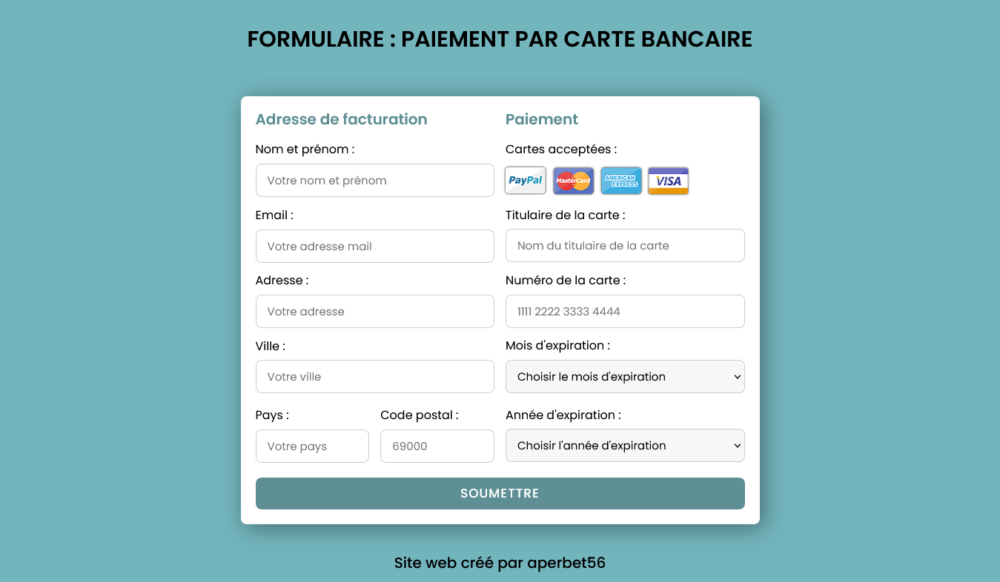

## FORMULAIRE : PAIEMENT PAR CARTE BANCAINRE (PAYMENT GATEMAY FORM)

## Le challenge

Création d'un formulaire de paiement par carte bancaire en HTML5, CSS3 et JavaScript. J'ai utilisé le JavaScript pour formater le champ de saisie : Numéro de carte bancaire.

## Démonstration

Lien vers le projet : https://aperbet56.github.io/payment_gateway/

## Développez avec

- Utilisation des balises sémantiques HTML5
- CSS3
- Flexbox
- Animations CSS
- Importation de la police Poppins
- Page web responsive
- Utilisation d'un normaliseur : le fichier normalize.css
- Desktop first
- JavaScript
- Code JavaScript commenté
- Regex (expressions régulières en JS)
